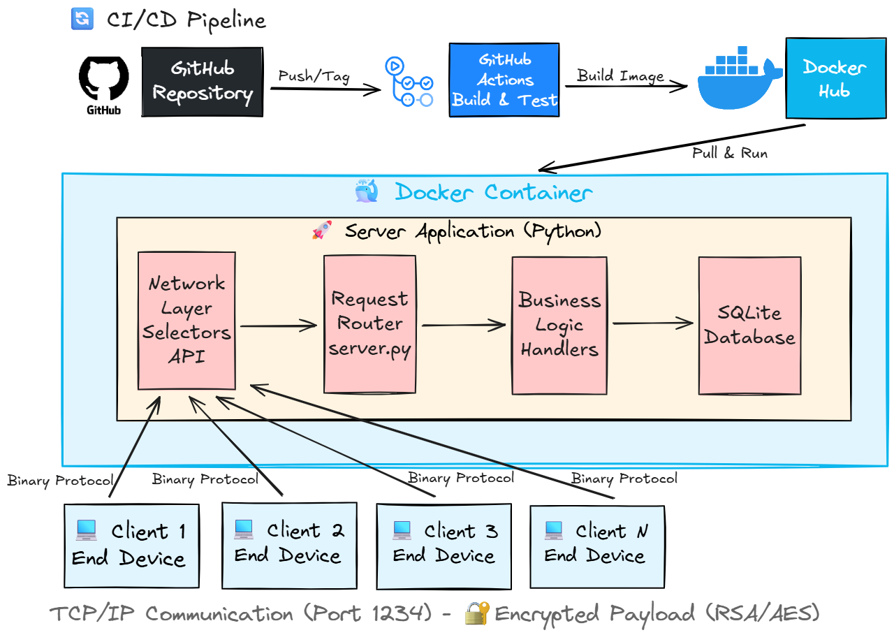

# MessageU - Secure Messaging System


## System Architecture & CI/CD Pipeline Overview

The diagram illustrates the integrated CI/CD pipeline (GitHub Actions to Docker Hub), the containerized Python server structure utilizing the Selectors API and SQLite, and the secure TCP/IP communication layer featuring the custom binary protocol and RSA/AES encrypted payloads.



For more details, see [SYSTEM_FLOW.md](SYSTEM_FLOW.md).

## Description

A secure, encrypted client-server messaging application implementing a custom application-layer protocol. The system features a C++ multi-threaded client and a Python server, designed with a focus on Defensive Programming principles and cryptographic security.

## 🚀 Quick Start - Running the System

You don't need to install anything except Docker to see the server in action!

### 1. Run the Server (Instant Deployment)

The server is available as a pre-built image on Docker Hub.

**Important:** Always pull the latest image before running to ensure you're using the most recent version:

pull the latest version of the server from Docker Hub:

```bash
  docker pull yehonatanshor/messageu-server:latest
```

Run the server container:

```bash
  docker run -d -p 1234:1234 --name msg-server yehonatanshor/messageu-server:latest
```

Note: The -d flag runs the server in the background.

### 2. View Server Logs (Live Monitoring)

To see the server activity (connected clients, encrypted messages, etc.) in real-time:

```bash
  docker logs -f msg-server
```

(Press Ctrl+C to exit the log view without stopping the server)

### 3. Run the Client

1. Download MessageUClient.exe from the [Latest Releases.](https://github.com/YehonatanShor/MessageU-Secure-Messaging-System/releases)

2. Ensure your server.info points to 127.0.0.1 1234.

3. Run MessageUClient.exe and start messaging!

### 4. Cleanup (Stop & Remove)

When you are done, run this command to stop the server and free up the port for next time:

```bash
  docker rm -f msg-server
```

## Key Features:

- **Hybrid E2EE Encryption:** Implements RSA (1024-bit) for key exchange and AES (CBC mode).
- **Security Enhancement:** Includes per-message generation of a **cryptographically secure, random Initialization Vector (IV)** to prevent pattern detection attacks.
- **Custom Binary Protocol:** Designed and implemented a proprietary binary protocol over TCP/IP (Big-Endian handling).
- **Cross-Language Architecture:** Interoperability between a C++17 client (using Boost.Asio) and a Python 3.12 server.
- **Persistent Storage:** Server-side data management using SQLite database.
- **Robust Functionality:** Supports user registration, file transfer, message queueing, and secure user deletion.
- **Defensive Coding:** Handles edge cases, buffer overflow protections, and rigorous input validation.

## CI/CD & Automated Testing

This project implements a professional DevOps pipeline using **GitHub Actions**, ensuring code reliability through:

- **Continuous Integration (CI):**

  - **Automated Compilation:** Cross-platform checks for the C++ Client (Windows/MinGW64).
  - **Static Code Analysis:** Automated linting with `flake8` to maintain PEP8 standards.
  - **Docker Build Verification:** Ensuring the Dockerfile remains functional on every update.

- **Continuous Deployment (CD):**
  - **Automated Distribution:** Builds and publishes Windows executables upon tag creation.
  - **Docker Hub Integration:** Automatically pushes the latest server image to Docker Hub for instant deployment.
  - **Edge Case Handling:** Verification of conflict handling (duplicate registrations) and user deletion logic.
- **End-to-End Integration Tests:** A sophisticated Python suite that simulates multiple clients to verify full protocol flow, key exchange, and E2EE delivery.

## Tech Stack:

- **Client:** C++17, Boost.Asio (Networking), Crypto++ (Encryption), OOP.
- **Server:** Python 3.12, Selectors API (I/O Multiplexing), SQLite3.

## Documentation

- **[SYSTEM_FLOW.md](SYSTEM_FLOW.md):** Comprehensive system flow documentation with detailed diagrams, protocol reference, and architecture overview.
- **[SECURITY_ASSESSMENT.md](SECURITY_ASSESSMENT.md):** Security analysis and vulnerability assessment of the MessageU protocol, including identified risks and remediation strategies.

## How to Build & Test (For Developers)

### 1. Manual Server Setup

1. Navigate to the server directory:

```bash
  cd server
```

2. Run the server:

```bash
  python server.py
```

### 2. Client Compilation

1. Navigate to the client directory: cd client/src

```bash
  cd client/src
```

2. Compile:

```bash
  g++ main.cpp MessageUClient.cpp RSAWrapper.cpp Base64Wrapper.cpp AESWrapper.cpp network/connection.cpp network/protocol_handler.cpp crypto/key_manager.cpp crypto/encryption.cpp storage/file_manager.cpp storage/client_storage.cpp ui/menu.cpp handlers/base_handler.cpp handlers/registration_handler.cpp handlers/client_list_handler.cpp handlers/public_key_handler.cpp handlers/messaging_handler.cpp handlers/deletion_handler.cpp -o main.exe -std=c++17 -lWs2_32 -lpthread -lcryptopp -I../include
```

### 3. Running Integration Tests

To verify the server logic locally:

1. Ensure the server is running.

2. From the root directory, run:

```bash
  python tests/integration_test.py
```

### 4. Local Docker Orchestration

To build and run the entire environment locally (including database persistence):

```bash
  docker-compose up --build
```

---

## Technical Highlights

### Architecture & Concurrency

The server implements **I/O multiplexing** using Python's `selectors` API, allowing a single-threaded process to handle hundreds of concurrent client connections efficiently. The event loop blocks on `select()`, which transfers control to the kernel - the process consumes zero CPU when idle and wakes only when I/O events occur. This pattern is the foundation of high-performance network servers (Nginx, Node.js, Redis).

### Key Exchange & Encryption Flow

The system implements a **hybrid encryption scheme** combining RSA (asymmetric) and AES (symmetric):

1. **Initial Setup:** Each client generates a 1024-bit RSA keypair during registration. The public key is stored on the server, the private key remains on the client.
2. **Symmetric Key Exchange:** When Client A wants to communicate with Client B:
   - Client A requests Client B's public key from the server
   - Client A generates a random AES-256 symmetric key
   - Client A encrypts the symmetric key with Client B's public RSA key and sends it via the server
   - Client B decrypts the symmetric key using their private RSA key
3. **Message Encryption:** All subsequent messages between A and B use AES-256 in CBC mode with a **cryptographically secure random IV** per message, preventing pattern detection attacks.

### Protocol Design

A **custom binary protocol** over TCP/IP using Big-Endian (network byte order) ensures cross-platform compatibility between the C++ client and Python server. The protocol uses fixed-size headers with request/response codes, enabling efficient parsing and minimal overhead. Messages are queued server-side until recipients pull them, supporting asynchronous communication.

### Network Architecture

- **Client:** Synchronous, single-threaded operations using Boost.Asio for TCP connections
- **Server:** Event-driven architecture with non-blocking sockets, handling multiple clients concurrently through a single event loop
- **Database:** SQLite with proper connection management and transaction handling for data persistence

### Security Considerations

The protocol includes several security measures: random IV generation per message, hybrid encryption (RSA + AES), and client-side key management. The system also includes comprehensive input validation and error handling. See [SECURITY_ASSESSMENT.md](SECURITY_ASSESSMENT.md) for detailed security analysis and identified vulnerabilities.
