# MessageU System Flow - Complete User Guide

## 📋 Table of Contents

1. [System Architecture Overview](#system-architecture-overview)
2. [Main Menu Options](#main-menu-options)
3. [Detailed Flow Diagrams](#detailed-flow-diagrams)
   - [Option 110: Register](#option-110---register)
   - [Option 120: Request Clients List](#option-120---request-clients-list)
   - [Option 130: Request Public Key](#option-130---request-public-key)
   - [Option 140: Request Waiting Messages](#option-140---request-waiting-messages)
   - [Option 150: Send Text Message](#option-150---send-text-message)
   - [Option 151: Request Symmetric Key](#option-151---request-symmetric-key)
   - [Option 152: Send Symmetric Key](#option-152---send-symmetric-key)
   - [Option 153: Send File](#option-153---send-file)
   - [Option 154: Delete User](#option-154---delete-user)
4. [Encryption Flow Summary](#encryption-flow-summary)
5. [Protocol Reference](#protocol-reference)

---

<a id="system-architecture-overview"></a>

## 🏗️ System Architecture Overview

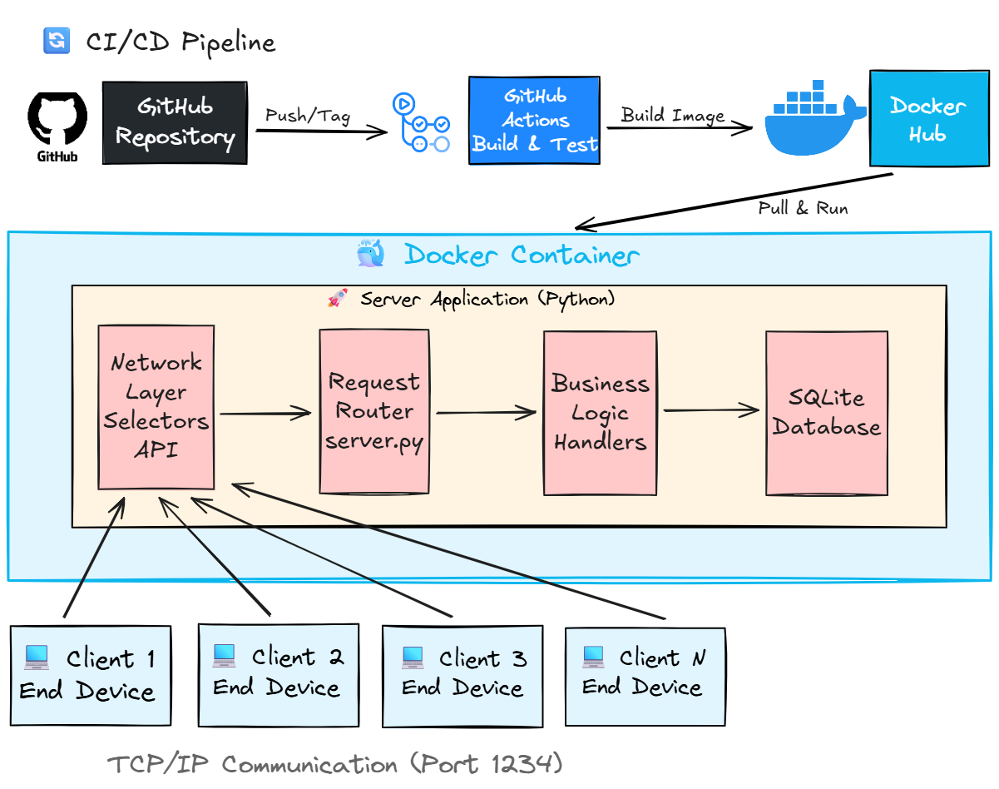

### Component Responsibilities

| Component           | Responsibility                                     |
| ------------------- | -------------------------------------------------- |
| **Client UI**       | User interaction, menu display, input/output       |
| **Client Handlers** | Business logic, request building, response parsing |
| **Client Network**  | TCP connection, protocol I/O, binary serialization |
| **Client Crypto**   | RSA key generation, AES encryption/decryption      |
| **Client Storage**  | Persist `my.info`, `server.info` files             |
| **Server Network**  | Accept connections, I/O multiplexing               |
| **Server Router**   | Parse requests, dispatch to handlers               |
| **Server Handlers** | Business logic, database operations                |
| **Database**        | Store clients, messages, metadata                  |

### Project File Structure

The project follows a modular architecture with clear separation of concerns:

#### Server Structure (Python)

```
server/
├── __init__.py
├── server.py                      # Entry point - only program startup
├── config/
│   ├── __init__.py
│   └── constants.py               # All protocol constants in one place
├── database/
│   ├── __init__.py
│   └── manager.py                  # DatabaseManager - only DB operations
├── network/
│   ├── __init__.py
│   ├── connection.py              # ConnectionState - connection state management
│   ├── protocol.py                # Binary protocol construction and parsing
│   └── server.py                  # Socket and event loop management
├── handlers/
│   ├── __init__.py
│   ├── registration.py            # handle_registration()
│   ├── client_list.py             # handle_client_list()
│   ├── public_key.py              # handle_public_key_request()
│   ├── messaging.py               # handle_send_message(), handle_pull_messages()
│   └── deletion.py                # handle_delete_user()
└── utils/
    ├── __init__.py
    └── responses.py                # send_response(), send_error_response()
```

#### Client Structure (C++)

```
client/
├── include/
│   ├── MessageUClient.h              # Main small class (orchestration)
│   ├── protocol/
│   │   ├── constants.h                # All protocol constants
│   │   ├── request_builder.h          # Request construction
│   │   └── response_parser.h          # Response parsing
│   ├── network/
│   │   ├── connection.h               # Network connection management
│   │   └── protocol_handler.h         # Low-level protocol I/O
│   ├── crypto/
│   │   ├── key_manager.h              # RSA key management
│   │   └── encryption.h               # AES encryption/decryption
│   ├── storage/
│   │   ├── file_manager.h             # File operations
│   │   └── client_storage.h           # Client storage utilities
│   ├── ui/
│   │   └── menu.h                     # Menu and user interface
│   └── handlers/
│       ├── base_handler.h             # Base handler with common utilities
│       ├── registration_handler.h     # Registration business logic
│       ├── client_list_handler.h      # Client list business logic
│       ├── public_key_handler.h       # Public key request logic
│       ├── messaging_handler.h        # Messaging business logic
│       └── deletion_handler.h         # User deletion logic
└── src/
    ├── main.cpp                       # Entry point
    ├── MessageUClient.cpp             # Orchestration implementation
    ├── protocol/
    │   └── constants.cpp
    ├── network/
    │   ├── connection.cpp
    │   └── protocol_handler.cpp
    ├── crypto/
    │   ├── key_manager.cpp
    │   └── encryption.cpp
    ├── storage/
    │   ├── file_manager.cpp
    │   └── client_storage.cpp
    ├── ui/
    │   └── menu.cpp
    └── handlers/
        ├── base_handler.cpp
        ├── registration_handler.cpp
        ├── client_list_handler.cpp
        ├── public_key_handler.cpp
        ├── messaging_handler.cpp
        └── deletion_handler.cpp
```

---

<a id="main-menu-options"></a>

## 📱 Main Menu Options

The client presents the following menu:

```
MessageU client at your service.

110) Register
120) Request for clients list
130) Request for public key
140) Request for waiting messages
150) Send a text message
151) Send a request for symmetric key
152) Send your symmetric key
153) Send a file
154) Delete user
0) Exit client
?
```

---

<a id="detailed-flow-diagrams"></a>

## 📊 Detailed Flow Diagrams

### Option 110 - Register

#### Sequence Diagram

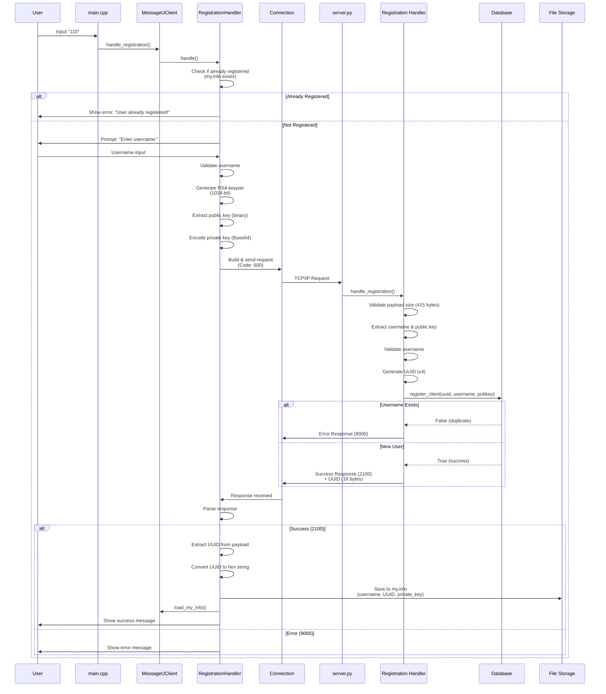
```mermaid
sequenceDiagram
    participant User
    participant Main as main.cpp
    participant Client as MessageUClient
    participant Handler as RegistrationHandler
    participant Network as Connection
    participant Server as server.py
    participant RegHandler as Registration Handler
    participant DB as Database
    participant Storage as File Storage

    User->>Main: Input "110"
    Main->>Client: handle_registration()
    Client->>Handler: handle()

    Handler->>Handler: Check if already registered<br/>(my.info exists)
    alt Already Registered
        Handler->>User: Show error: "User already registered!"
    else Not Registered
        Handler->>User: Prompt: "Enter username:"
        User->>Handler: Username input
        Handler->>Handler: Validate username

        Handler->>Handler: Generate RSA keypair<br/>(1024-bit)
        Handler->>Handler: Extract public key (binary)
        Handler->>Handler: Encode private key (Base64)

        Handler->>Network: Build & send request<br/>(Code: 600)
        Network->>Server: TCP/IP Request

        Server->>RegHandler: handle_registration()
        RegHandler->>RegHandler: Validate payload size (415 bytes)
        RegHandler->>RegHandler: Extract username & public key
        RegHandler->>RegHandler: Validate username

        RegHandler->>RegHandler: Generate UUID (v4)
        RegHandler->>DB: register_client(uuid, username, pubkey)

        alt Username Exists
            DB-->>RegHandler: False (duplicate)
            RegHandler->>Network: Error Response (9000)
        else New User
            DB-->>RegHandler: True (success)
            RegHandler->>Network: Success Response (2100)<br/>+ UUID (16 bytes)
        end

        Network->>Handler: Response received
        Handler->>Handler: Parse response

        alt Success (2100)
            Handler->>Handler: Extract UUID from payload
            Handler->>Handler: Convert UUID to hex string
            Handler->>Storage: Save to my.info<br/>(username, UUID, private_key)
            Handler->>Client: load_my_info()
            Handler->>User: Show success message
        else Error (9000)
            Handler->>User: Show error message
        end
    end
```

#### Flowchart

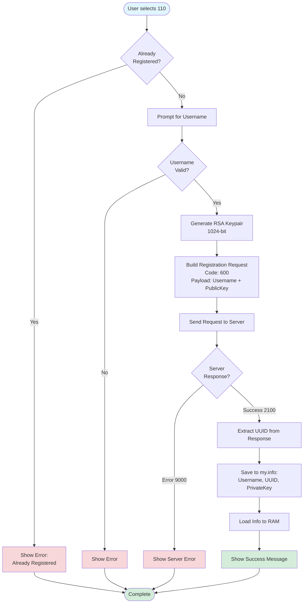
```mermaid
flowchart TD
    Start([User selects 110]) --> CheckReg{Already<br/>Registered?}
    CheckReg -->|Yes| Error1[Show Error:<br/>Already Registered]
    CheckReg -->|No| GetUsername[Prompt for Username]
    GetUsername --> ValidateUser{Username<br/>Valid?}
    ValidateUser -->|No| Error2[Show Error]
    ValidateUser -->|Yes| GenKeys[Generate RSA Keypair<br/>1024-bit]
    GenKeys --> BuildReq[Build Registration Request<br/>Code: 600<br/>Payload: Username + PublicKey]
    BuildReq --> SendReq[Send Request to Server]
    SendReq --> ServerCheck{Server<br/>Response?}
    ServerCheck -->|Error 9000| ShowError[Show Server Error]
    ServerCheck -->|Success 2100| ExtractUUID[Extract UUID from Response]
    ExtractUUID --> SaveInfo[Save to my.info:<br/>Username, UUID, PrivateKey]
    SaveInfo --> LoadRAM[Load Info to RAM]
    LoadRAM --> ShowSuccess[Show Success Message]
    ShowSuccess --> End([Complete])
    Error1 --> End
    Error2 --> End
    ShowError --> End

    style Start fill:#e1f5ff
    style End fill:#d4edda
    style Error1 fill:#f8d7da
    style Error2 fill:#f8d7da
    style ShowError fill:#f8d7da
    style ShowSuccess fill:#d4edda
```

#### Request/Response Format

**Request:**

```
┌─────────────┬──────────┬──────────┬──────────────┬─────────────────────────────┐
│ ClientID    │ Version  │ Code     │ PayloadSize  │ Payload                    │
│ (16 bytes)  │ (1 byte) │ (2 bytes)│ (4 bytes)    │ (415 bytes)                 │
│ 0x00...     │ 0x02     │ 0x0258   │ 0x0000019F   │ Username(255) + PubKey(160)│
└─────────────┴──────────┴──────────┴──────────────┴─────────────────────────────┘
```

**Response (Success):**

```
┌──────────┬──────────┬──────────────┬──────────┐
│ Version  │ Code     │ PayloadSize  │ Payload  │
│ (1 byte) │ (2 bytes)│ (4 bytes)    │ (16 bytes)│
│ 0x02     │ 0x0834   │ 0x00000010   │ UUID     │
└──────────┴──────────┴──────────────┴──────────┘
```

---

### Option 120 - Request Clients List

#### Sequence Diagram

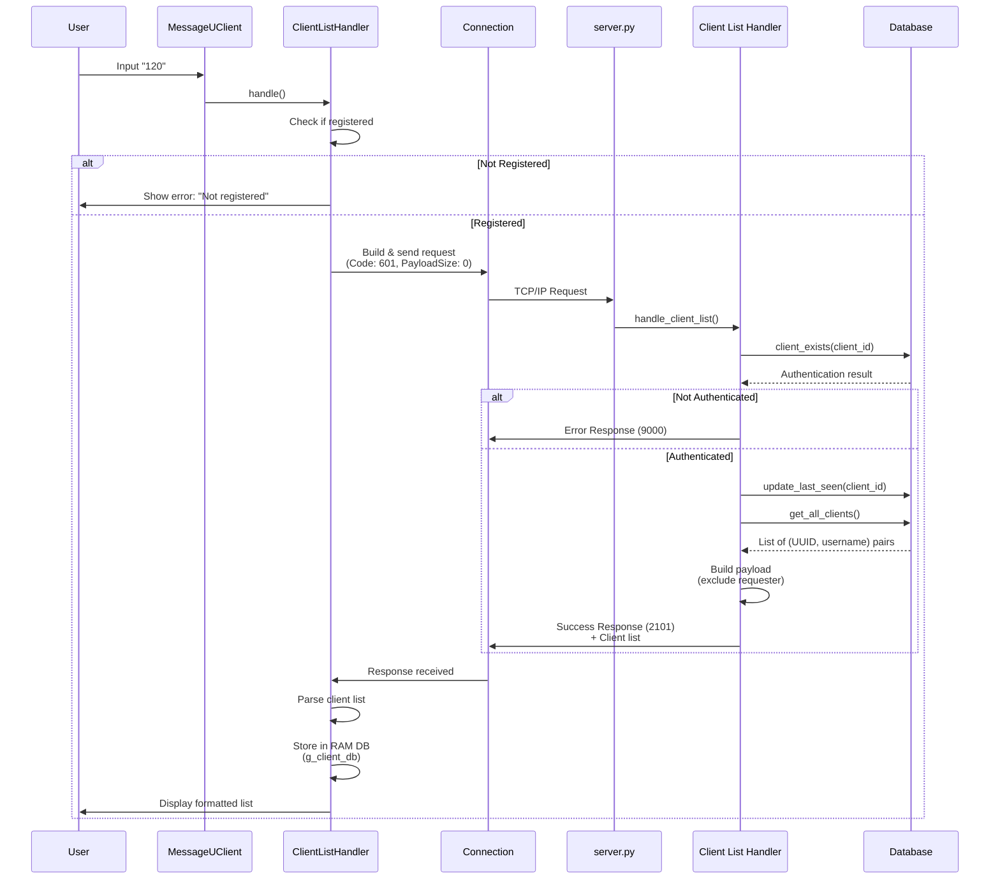
```mermaid
sequenceDiagram
    participant User
    participant Client as MessageUClient
    participant Handler as ClientListHandler
    participant Network as Connection
    participant Server as server.py
    participant ListHandler as Client List Handler
    participant DB as Database

    User->>Client: Input "120"
    Client->>Handler: handle()

    Handler->>Handler: Check if registered
    alt Not Registered
        Handler->>User: Show error: "Not registered"
    else Registered
        Handler->>Network: Build & send request<br/>(Code: 601, PayloadSize: 0)
        Network->>Server: TCP/IP Request

        Server->>ListHandler: handle_client_list()
        ListHandler->>DB: client_exists(client_id)
        DB-->>ListHandler: Authentication result

        alt Not Authenticated
            ListHandler->>Network: Error Response (9000)
        else Authenticated
            ListHandler->>DB: update_last_seen(client_id)
            ListHandler->>DB: get_all_clients()
            DB-->>ListHandler: List of (UUID, username) pairs

            ListHandler->>ListHandler: Build payload<br/>(exclude requester)
            ListHandler->>Network: Success Response (2101)<br/>+ Client list
        end

        Network->>Handler: Response received
        Handler->>Handler: Parse client list
        Handler->>Handler: Store in RAM DB<br/>(g_client_db)
        Handler->>User: Display formatted list
    end
```

#### Flowchart

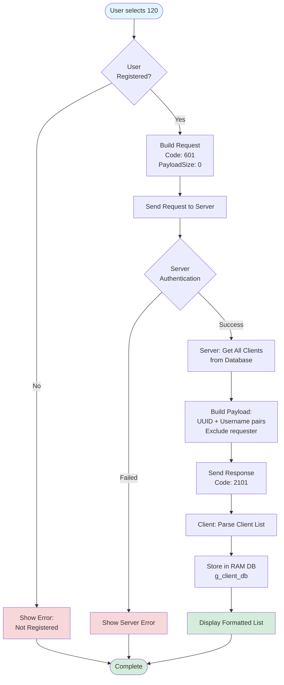
```mermaid
flowchart TD
    Start([User selects 120]) --> CheckReg{User<br/>Registered?}
    CheckReg -->|No| Error1[Show Error:<br/>Not Registered]
    CheckReg -->|Yes| BuildReq[Build Request<br/>Code: 601<br/>PayloadSize: 0]
    BuildReq --> SendReq[Send Request to Server]
    SendReq --> Auth{Server<br/>Authentication}
    Auth -->|Failed| ShowError[Show Server Error]
    Auth -->|Success| GetClients[Server: Get All Clients<br/>from Database]
    GetClients --> BuildPayload[Build Payload:<br/>UUID + Username pairs<br/>Exclude requester]
    BuildPayload --> SendResp[Send Response<br/>Code: 2101]
    SendResp --> ParseList[Client: Parse Client List]
    ParseList --> StoreRAM[Store in RAM DB<br/>g_client_db]
    StoreRAM --> Display[Display Formatted List]
    Display --> End([Complete])
    Error1 --> End
    ShowError --> End

    style Start fill:#e1f5ff
    style End fill:#d4edda
    style Error1 fill:#f8d7da
    style ShowError fill:#f8d7da
    style Display fill:#d4edda
```

---

### Option 130 - Request Public Key

#### Sequence Diagram

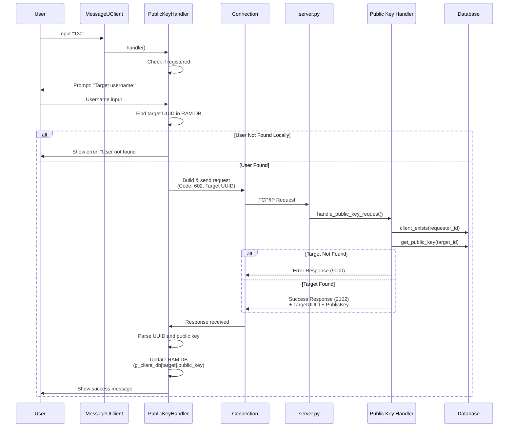
```mermaid
sequenceDiagram
    participant User
    participant Client as MessageUClient
    participant Handler as PublicKeyHandler
    participant Network as Connection
    participant Server as server.py
    participant KeyHandler as Public Key Handler
    participant DB as Database

    User->>Client: Input "130"
    Client->>Handler: handle()

    Handler->>Handler: Check if registered
    Handler->>User: Prompt: "Target username:"
    User->>Handler: Username input
    Handler->>Handler: Find target UUID in RAM DB

    alt User Not Found Locally
        Handler->>User: Show error: "User not found"
    else User Found
        Handler->>Network: Build & send request<br/>(Code: 602, Target UUID)
        Network->>Server: TCP/IP Request

        Server->>KeyHandler: handle_public_key_request()
        KeyHandler->>DB: client_exists(requester_id)
        KeyHandler->>DB: get_public_key(target_id)

        alt Target Not Found
            KeyHandler->>Network: Error Response (9000)
        else Target Found
            KeyHandler->>Network: Success Response (2102)<br/>+ TargetUUID + PublicKey
        end

        Network->>Handler: Response received
        Handler->>Handler: Parse UUID and public key
        Handler->>Handler: Update RAM DB<br/>(g_client_db[target].public_key)
        Handler->>User: Show success message
    end
```

#### Flowchart

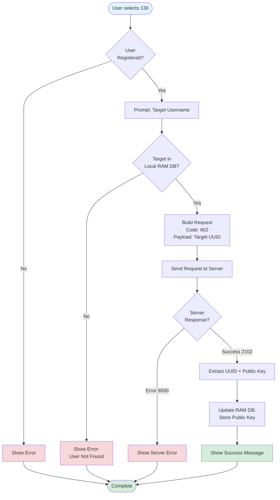
```mermaid
flowchart TD
    Start([User selects 130]) --> CheckReg{User<br/>Registered?}
    CheckReg -->|No| Error1[Show Error]
    CheckReg -->|Yes| GetTarget[Prompt: Target Username]
    GetTarget --> FindLocal{Target in<br/>Local RAM DB?}
    FindLocal -->|No| Error2[Show Error:<br/>User Not Found]
    FindLocal -->|Yes| BuildReq[Build Request<br/>Code: 602<br/>Payload: Target UUID]
    BuildReq --> SendReq[Send Request to Server]
    SendReq --> ServerCheck{Server<br/>Response?}
    ServerCheck -->|Error 9000| ShowError[Show Server Error]
    ServerCheck -->|Success 2102| ExtractKey[Extract UUID + Public Key]
    ExtractKey --> UpdateRAM[Update RAM DB:<br/>Store Public Key]
    UpdateRAM --> ShowSuccess[Show Success Message]
    ShowSuccess --> End([Complete])
    Error1 --> End
    Error2 --> End
    ShowError --> End

    style Start fill:#e1f5ff
    style End fill:#d4edda
    style Error1 fill:#f8d7da
    style Error2 fill:#f8d7da
    style ShowError fill:#f8d7da
    style ShowSuccess fill:#d4edda
```

---

### Option 140 - Request Waiting Messages

#### Sequence Diagram

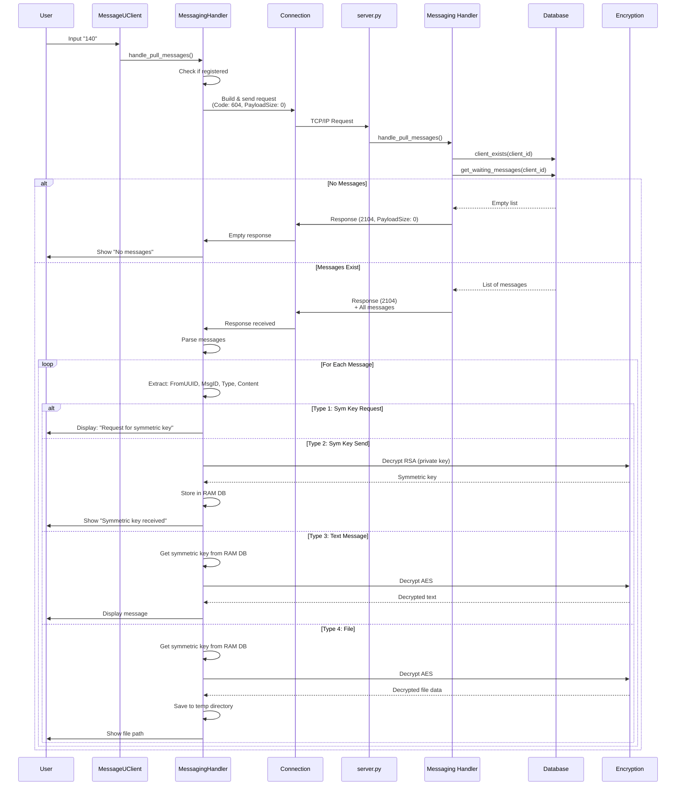
```mermaid
sequenceDiagram
    participant User
    participant Client as MessageUClient
    participant Handler as MessagingHandler
    participant Network as Connection
    participant Server as server.py
    participant MsgHandler as Messaging Handler
    participant DB as Database
    participant Crypto as Encryption

    User->>Client: Input "140"
    Client->>Handler: handle_pull_messages()

    Handler->>Handler: Check if registered
    Handler->>Network: Build & send request<br/>(Code: 604, PayloadSize: 0)
    Network->>Server: TCP/IP Request

    Server->>MsgHandler: handle_pull_messages()
    MsgHandler->>DB: client_exists(client_id)
    MsgHandler->>DB: get_waiting_messages(client_id)

    alt No Messages
        DB-->>MsgHandler: Empty list
        MsgHandler->>Network: Response (2104, PayloadSize: 0)
        Network->>Handler: Empty response
        Handler->>User: Show "No messages"
    else Messages Exist
        DB-->>MsgHandler: List of messages
        MsgHandler->>Network: Response (2104)<br/>+ All messages

        Network->>Handler: Response received
        Handler->>Handler: Parse messages

        loop For Each Message
            Handler->>Handler: Extract: FromUUID, MsgID, Type, Content

            alt Type 1: Sym Key Request
                Handler->>User: Display: "Request for symmetric key"
            else Type 2: Sym Key Send
                Handler->>Crypto: Decrypt RSA (private key)
                Crypto-->>Handler: Symmetric key
                Handler->>Handler: Store in RAM DB
                Handler->>User: Show "Symmetric key received"
            else Type 3: Text Message
                Handler->>Handler: Get symmetric key from RAM DB
                Handler->>Crypto: Decrypt AES
                Crypto-->>Handler: Decrypted text
                Handler->>User: Display message
            else Type 4: File
                Handler->>Handler: Get symmetric key from RAM DB
                Handler->>Crypto: Decrypt AES
                Crypto-->>Handler: Decrypted file data
                Handler->>Handler: Save to temp directory
                Handler->>User: Show file path
            end
        end
    end
```

#### Flowchart

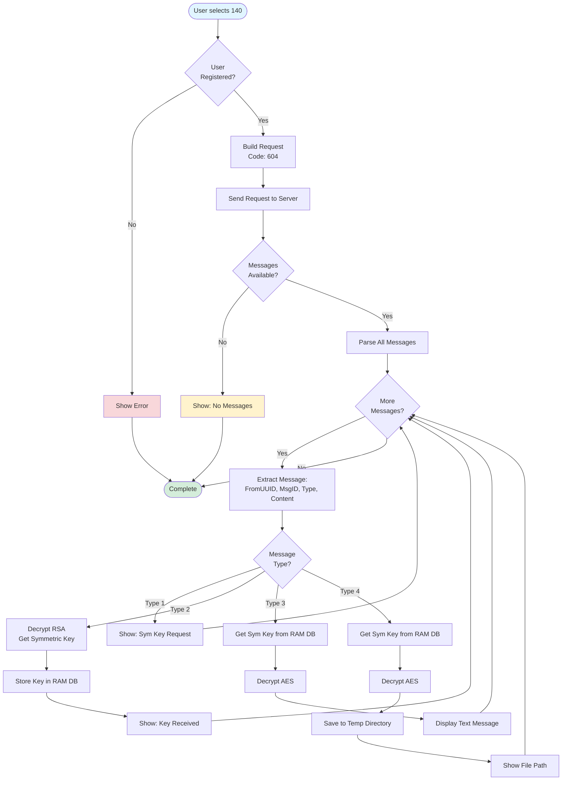
```mermaid
flowchart TD
    Start([User selects 140]) --> CheckReg{User<br/>Registered?}
    CheckReg -->|No| Error1[Show Error]
    CheckReg -->|Yes| BuildReq[Build Request<br/>Code: 604]
    BuildReq --> SendReq[Send Request to Server]
    SendReq --> CheckMsgs{Messages<br/>Available?}
    CheckMsgs -->|No| ShowNoMsg[Show: No Messages]
    CheckMsgs -->|Yes| ParseMsgs[Parse All Messages]
    ParseMsgs --> LoopStart{More<br/>Messages?}
    LoopStart -->|Yes| ExtractMsg[Extract Message:<br/>FromUUID, MsgID, Type, Content]
    ExtractMsg --> CheckType{Message<br/>Type?}
    CheckType -->|Type 1| ShowReq[Show: Sym Key Request]
    CheckType -->|Type 2| DecryptRSA[Decrypt RSA<br/>Get Symmetric Key]
    DecryptRSA --> StoreKey[Store Key in RAM DB]
    StoreKey --> ShowKey[Show: Key Received]
    CheckType -->|Type 3| GetKey1[Get Sym Key from RAM DB]
    GetKey1 --> DecryptAES1[Decrypt AES]
    DecryptAES1 --> ShowText[Display Text Message]
    CheckType -->|Type 4| GetKey2[Get Sym Key from RAM DB]
    GetKey2 --> DecryptAES2[Decrypt AES]
    DecryptAES2 --> SaveFile[Save to Temp Directory]
    SaveFile --> ShowFile[Show File Path]
    ShowReq --> LoopStart
    ShowKey --> LoopStart
    ShowText --> LoopStart
    ShowFile --> LoopStart
    LoopStart -->|No| End([Complete])
    Error1 --> End
    ShowNoMsg --> End

    style Start fill:#e1f5ff
    style End fill:#d4edda
    style Error1 fill:#f8d7da
    style ShowNoMsg fill:#fff3cd
```

---

### Option 150 - Send Text Message

#### Sequence Diagram

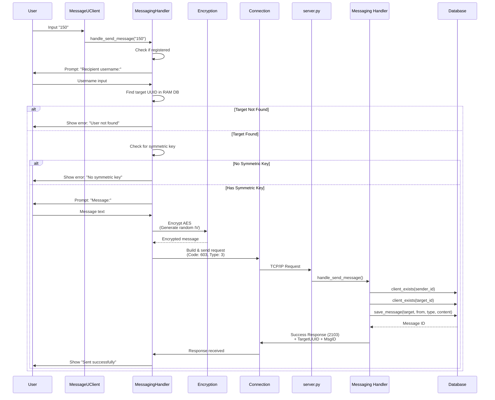
```mermaid
sequenceDiagram
    participant User
    participant Client as MessageUClient
    participant Handler as MessagingHandler
    participant Crypto as Encryption
    participant Network as Connection
    participant Server as server.py
    participant MsgHandler as Messaging Handler
    participant DB as Database

    User->>Client: Input "150"
    Client->>Handler: handle_send_message("150")

    Handler->>Handler: Check if registered
    Handler->>User: Prompt: "Recipient username:"
    User->>Handler: Username input
    Handler->>Handler: Find target UUID in RAM DB

    alt Target Not Found
        Handler->>User: Show error: "User not found"
    else Target Found
        Handler->>Handler: Check for symmetric key

        alt No Symmetric Key
            Handler->>User: Show error: "No symmetric key"
        else Has Symmetric Key
            Handler->>User: Prompt: "Message:"
            User->>Handler: Message text
            Handler->>Crypto: Encrypt AES<br/>(Generate random IV)
            Crypto-->>Handler: Encrypted message

            Handler->>Network: Build & send request<br/>(Code: 603, Type: 3)
            Network->>Server: TCP/IP Request

            Server->>MsgHandler: handle_send_message()
            MsgHandler->>DB: client_exists(sender_id)
            MsgHandler->>DB: client_exists(target_id)
            MsgHandler->>DB: save_message(target, from, type, content)
            DB-->>MsgHandler: Message ID
            MsgHandler->>Network: Success Response (2103)<br/>+ TargetUUID + MsgID

            Network->>Handler: Response received
            Handler->>User: Show "Sent successfully"
        end
    end
```

#### Flowchart

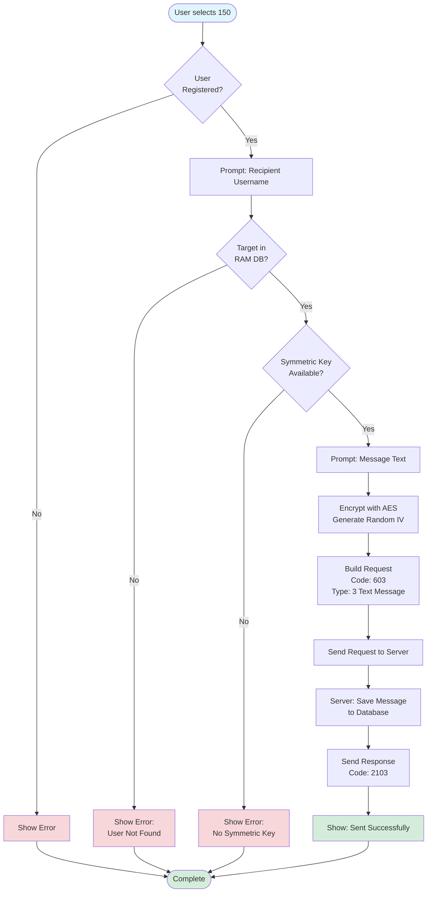
```mermaid
flowchart TD
    Start([User selects 150]) --> CheckReg{User<br/>Registered?}
    CheckReg -->|No| Error1[Show Error]
    CheckReg -->|Yes| GetTarget[Prompt: Recipient Username]
    GetTarget --> FindTarget{Target in<br/>RAM DB?}
    FindTarget -->|No| Error2[Show Error:<br/>User Not Found]
    FindTarget -->|Yes| CheckKey{Symmetric Key<br/>Available?}
    CheckKey -->|No| Error3[Show Error:<br/>No Symmetric Key]
    CheckKey -->|Yes| GetMsg[Prompt: Message Text]
    GetMsg --> Encrypt[Encrypt with AES<br/>Generate Random IV]
    Encrypt --> BuildReq[Build Request<br/>Code: 603<br/>Type: 3 Text Message]
    BuildReq --> SendReq[Send Request to Server]
    SendReq --> ServerSave[Server: Save Message<br/>to Database]
    ServerSave --> SendResp[Send Response<br/>Code: 2103]
    SendResp --> ShowSuccess[Show: Sent Successfully]
    ShowSuccess --> End([Complete])
    Error1 --> End
    Error2 --> End
    Error3 --> End

    style Start fill:#e1f5ff
    style End fill:#d4edda
    style Error1 fill:#f8d7da
    style Error2 fill:#f8d7da
    style Error3 fill:#f8d7da
    style ShowSuccess fill:#d4edda
```

---

### Option 151 - Request Symmetric Key

#### Sequence Diagram

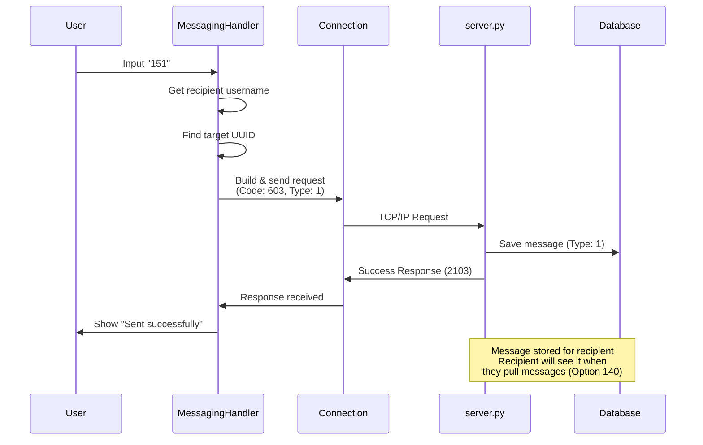
```mermaid
sequenceDiagram
    participant User
    participant Handler as MessagingHandler
    participant Network as Connection
    participant Server as server.py
    participant DB as Database

    User->>Handler: Input "151"
    Handler->>Handler: Get recipient username
    Handler->>Handler: Find target UUID
    Handler->>Network: Build & send request<br/>(Code: 603, Type: 1)
    Network->>Server: TCP/IP Request
    Server->>DB: Save message (Type: 1)
    Server->>Network: Success Response (2103)
    Network->>Handler: Response received
    Handler->>User: Show "Sent successfully"

    Note over Server,DB: Message stored for recipient<br/>Recipient will see it when<br/>they pull messages (Option 140)
```

#### Flowchart

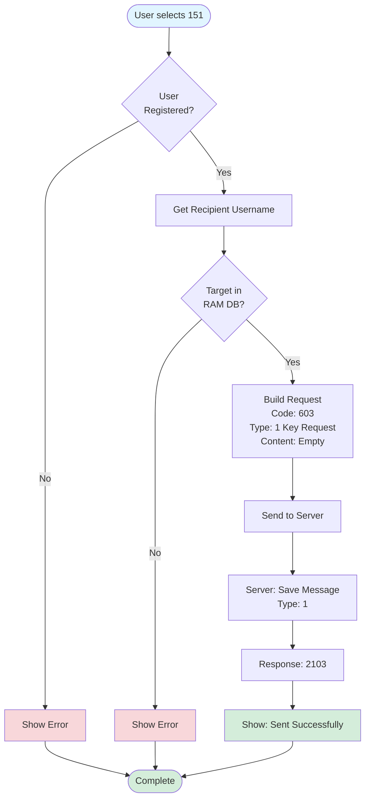
```mermaid
flowchart TD
    Start([User selects 151]) --> CheckReg{User<br/>Registered?}
    CheckReg -->|No| Error1[Show Error]
    CheckReg -->|Yes| GetTarget[Get Recipient Username]
    GetTarget --> FindTarget{Target in<br/>RAM DB?}
    FindTarget -->|No| Error2[Show Error]
    FindTarget -->|Yes| BuildReq[Build Request<br/>Code: 603<br/>Type: 1 Key Request<br/>Content: Empty]
    BuildReq --> SendReq[Send to Server]
    SendReq --> ServerSave[Server: Save Message<br/>Type: 1]
    ServerSave --> SendResp[Response: 2103]
    SendResp --> ShowSuccess[Show: Sent Successfully]
    ShowSuccess --> End([Complete])
    Error1 --> End
    Error2 --> End

    style Start fill:#e1f5ff
    style End fill:#d4edda
    style Error1 fill:#f8d7da
    style Error2 fill:#f8d7da
    style ShowSuccess fill:#d4edda
```

---

### Option 152 - Send Symmetric Key

#### Sequence Diagram

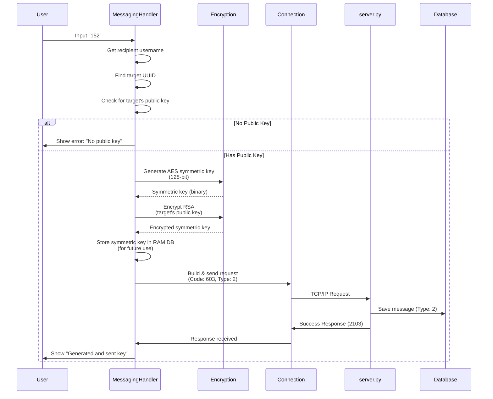
```mermaid
sequenceDiagram
    participant User
    participant Handler as MessagingHandler
    participant Crypto as Encryption
    participant Network as Connection
    participant Server as server.py
    participant DB as Database

    User->>Handler: Input "152"
    Handler->>Handler: Get recipient username
    Handler->>Handler: Find target UUID
    Handler->>Handler: Check for target's public key

    alt No Public Key
        Handler->>User: Show error: "No public key"
    else Has Public Key
        Handler->>Crypto: Generate AES symmetric key<br/>(128-bit)
        Crypto-->>Handler: Symmetric key (binary)
        Handler->>Crypto: Encrypt RSA<br/>(target's public key)
        Crypto-->>Handler: Encrypted symmetric key
        Handler->>Handler: Store symmetric key in RAM DB<br/>(for future use)
        Handler->>Network: Build & send request<br/>(Code: 603, Type: 2)
        Network->>Server: TCP/IP Request
        Server->>DB: Save message (Type: 2)
        Server->>Network: Success Response (2103)
        Network->>Handler: Response received
        Handler->>User: Show "Generated and sent key"
    end
```

#### Flowchart

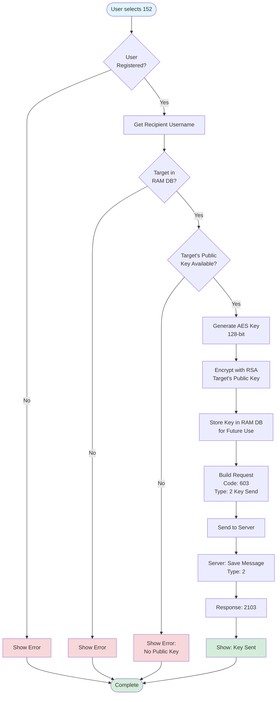
```mermaid
flowchart TD
    Start([User selects 152]) --> CheckReg{User<br/>Registered?}
    CheckReg -->|No| Error1[Show Error]
    CheckReg -->|Yes| GetTarget[Get Recipient Username]
    GetTarget --> FindTarget{Target in<br/>RAM DB?}
    FindTarget -->|No| Error2[Show Error]
    FindTarget -->|Yes| CheckPubKey{Target's Public<br/>Key Available?}
    CheckPubKey -->|No| Error3[Show Error:<br/>No Public Key]
    CheckPubKey -->|Yes| GenKey[Generate AES Key<br/>128-bit]
    GenKey --> EncryptRSA[Encrypt with RSA<br/>Target's Public Key]
    EncryptRSA --> StoreKey[Store Key in RAM DB<br/>for Future Use]
    StoreKey --> BuildReq[Build Request<br/>Code: 603<br/>Type: 2 Key Send]
    BuildReq --> SendReq[Send to Server]
    SendReq --> ServerSave[Server: Save Message<br/>Type: 2]
    ServerSave --> SendResp[Response: 2103]
    SendResp --> ShowSuccess[Show: Key Sent]
    ShowSuccess --> End([Complete])
    Error1 --> End
    Error2 --> End
    Error3 --> End

    style Start fill:#e1f5ff
    style End fill:#d4edda
    style Error1 fill:#f8d7da
    style Error2 fill:#f8d7da
    style Error3 fill:#f8d7da
    style ShowSuccess fill:#d4edda
```

---

### Option 153 - Send File

#### Sequence Diagram

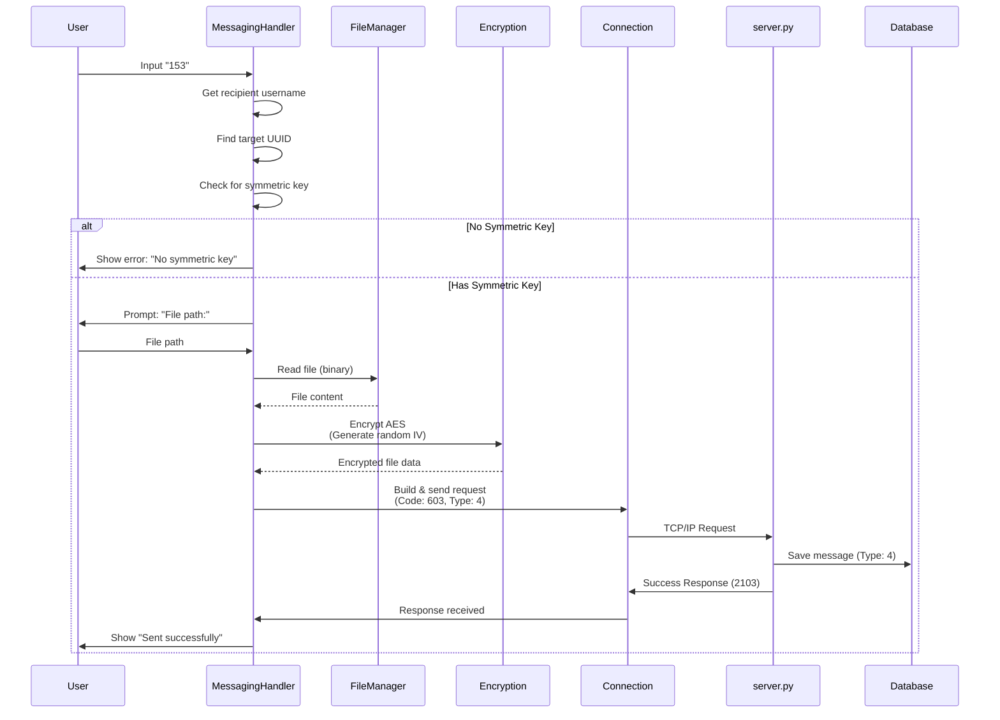
```mermaid
sequenceDiagram
    participant User
    participant Handler as MessagingHandler
    participant Storage as FileManager
    participant Crypto as Encryption
    participant Network as Connection
    participant Server as server.py
    participant DB as Database

    User->>Handler: Input "153"
    Handler->>Handler: Get recipient username
    Handler->>Handler: Find target UUID
    Handler->>Handler: Check for symmetric key

    alt No Symmetric Key
        Handler->>User: Show error: "No symmetric key"
    else Has Symmetric Key
        Handler->>User: Prompt: "File path:"
        User->>Handler: File path
        Handler->>Storage: Read file (binary)
        Storage-->>Handler: File content
        Handler->>Crypto: Encrypt AES<br/>(Generate random IV)
        Crypto-->>Handler: Encrypted file data
        Handler->>Network: Build & send request<br/>(Code: 603, Type: 4)
        Network->>Server: TCP/IP Request
        Server->>DB: Save message (Type: 4)
        Server->>Network: Success Response (2103)
        Network->>Handler: Response received
        Handler->>User: Show "Sent successfully"
    end
```

#### Flowchart

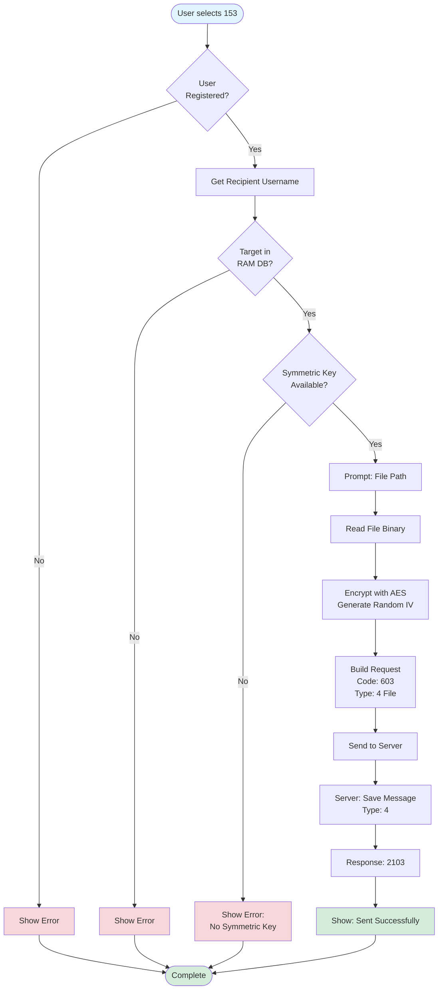
```mermaid
flowchart TD
    Start([User selects 153]) --> CheckReg{User<br/>Registered?}
    CheckReg -->|No| Error1[Show Error]
    CheckReg -->|Yes| GetTarget[Get Recipient Username]
    GetTarget --> FindTarget{Target in<br/>RAM DB?}
    FindTarget -->|No| Error2[Show Error]
    FindTarget -->|Yes| CheckKey{Symmetric Key<br/>Available?}
    CheckKey -->|No| Error3[Show Error:<br/>No Symmetric Key]
    CheckKey -->|Yes| GetFile[Prompt: File Path]
    GetFile --> ReadFile[Read File Binary]
    ReadFile --> Encrypt[Encrypt with AES<br/>Generate Random IV]
    Encrypt --> BuildReq[Build Request<br/>Code: 603<br/>Type: 4 File]
    BuildReq --> SendReq[Send to Server]
    SendReq --> ServerSave[Server: Save Message<br/>Type: 4]
    ServerSave --> SendResp[Response: 2103]
    SendResp --> ShowSuccess[Show: Sent Successfully]
    ShowSuccess --> End([Complete])
    Error1 --> End
    Error2 --> End
    Error3 --> End

    style Start fill:#e1f5ff
    style End fill:#d4edda
    style Error1 fill:#f8d7da
    style Error2 fill:#f8d7da
    style Error3 fill:#f8d7da
    style ShowSuccess fill:#d4edda
```

---

### Option 154 - Delete User

#### Sequence Diagram

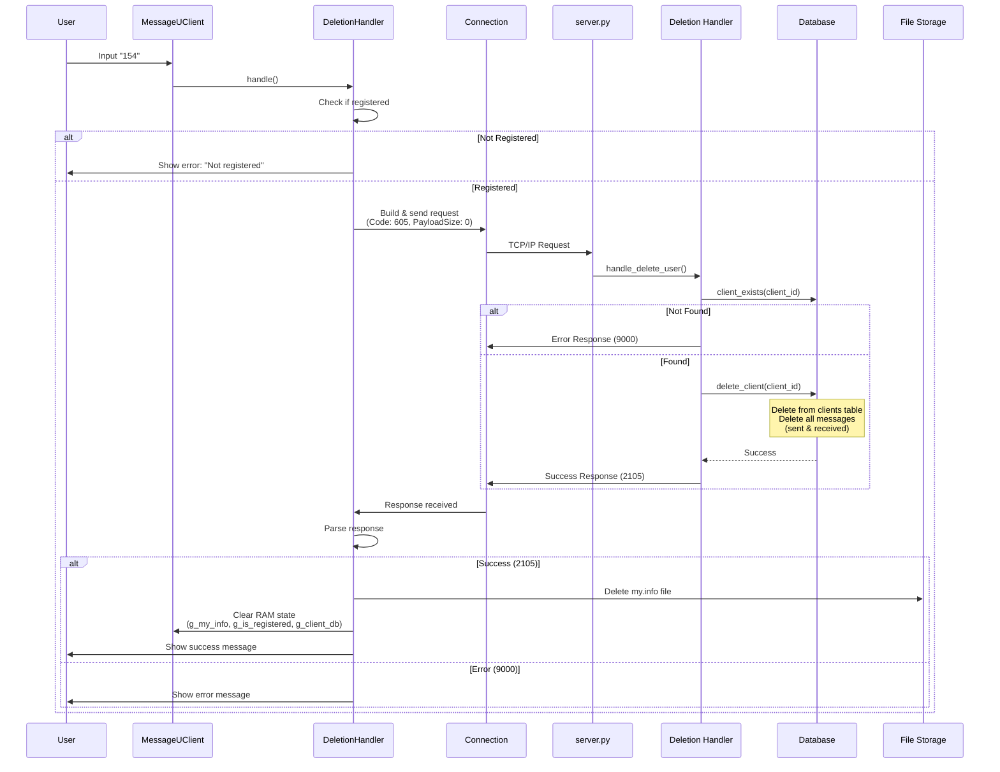
```mermaid
sequenceDiagram
    participant User
    participant Client as MessageUClient
    participant Handler as DeletionHandler
    participant Network as Connection
    participant Server as server.py
    participant DelHandler as Deletion Handler
    participant DB as Database
    participant Storage as File Storage

    User->>Client: Input "154"
    Client->>Handler: handle()

    Handler->>Handler: Check if registered
    alt Not Registered
        Handler->>User: Show error: "Not registered"
    else Registered
        Handler->>Network: Build & send request<br/>(Code: 605, PayloadSize: 0)
        Network->>Server: TCP/IP Request

        Server->>DelHandler: handle_delete_user()
        DelHandler->>DB: client_exists(client_id)

        alt Not Found
            DelHandler->>Network: Error Response (9000)
        else Found
            DelHandler->>DB: delete_client(client_id)
            Note over DB: Delete from clients table<br/>Delete all messages<br/>(sent & received)
            DB-->>DelHandler: Success
            DelHandler->>Network: Success Response (2105)
        end

        Network->>Handler: Response received
        Handler->>Handler: Parse response

        alt Success (2105)
            Handler->>Storage: Delete my.info file
            Handler->>Client: Clear RAM state<br/>(g_my_info, g_is_registered, g_client_db)
            Handler->>User: Show success message
        else Error (9000)
            Handler->>User: Show error message
        end
    end
```

#### Flowchart

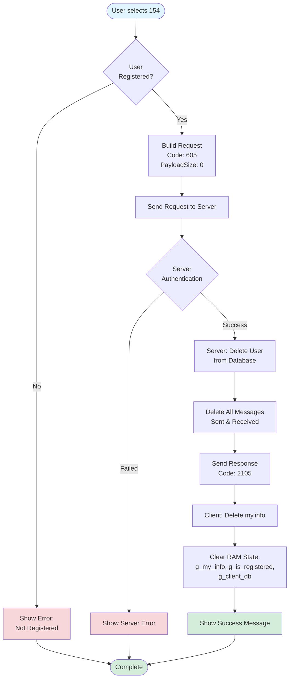
```mermaid
flowchart TD
    Start([User selects 154]) --> CheckReg{User<br/>Registered?}
    CheckReg -->|No| Error1[Show Error:<br/>Not Registered]
    CheckReg -->|Yes| BuildReq[Build Request<br/>Code: 605<br/>PayloadSize: 0]
    BuildReq --> SendReq[Send Request to Server]
    SendReq --> Auth{Server<br/>Authentication}
    Auth -->|Failed| ShowError[Show Server Error]
    Auth -->|Success| DeleteDB[Server: Delete User<br/>from Database]
    DeleteDB --> DeleteMsgs[Delete All Messages<br/>Sent & Received]
    DeleteMsgs --> SendResp[Send Response<br/>Code: 2105]
    SendResp --> DeleteFile[Client: Delete my.info]
    DeleteFile --> ClearRAM[Clear RAM State:<br/>g_my_info, g_is_registered,<br/>g_client_db]
    ClearRAM --> ShowSuccess[Show Success Message]
    ShowSuccess --> End([Complete])
    Error1 --> End
    ShowError --> End

    style Start fill:#e1f5ff
    style End fill:#d4edda
    style Error1 fill:#f8d7da
    style ShowError fill:#f8d7da
    style ShowSuccess fill:#d4edda
```

---

<a id="encryption-flow-summary"></a>

## 🔐 Encryption Flow Summary

### Complete Key Exchange Process

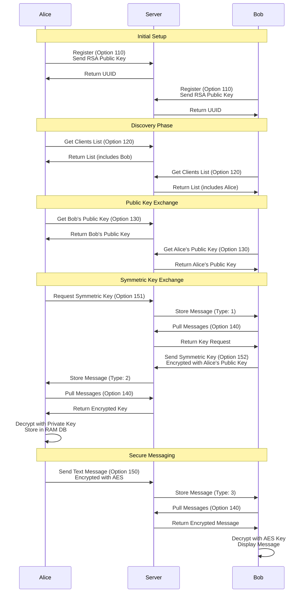
```mermaid
sequenceDiagram
    participant Alice
    participant Server
    participant Bob

    Note over Alice,Bob: Initial Setup
    Alice->>Server: Register (Option 110)<br/>Send RSA Public Key
    Server->>Alice: Return UUID
    Bob->>Server: Register (Option 110)<br/>Send RSA Public Key
    Server->>Bob: Return UUID

    Note over Alice,Bob: Discovery Phase
    Alice->>Server: Get Clients List (Option 120)
    Server->>Alice: Return List (includes Bob)
    Bob->>Server: Get Clients List (Option 120)
    Server->>Bob: Return List (includes Alice)

    Note over Alice,Bob: Public Key Exchange
    Alice->>Server: Get Bob's Public Key (Option 130)
    Server->>Alice: Return Bob's Public Key
    Bob->>Server: Get Alice's Public Key (Option 130)
    Server->>Bob: Return Alice's Public Key

    Note over Alice,Bob: Symmetric Key Exchange
    Alice->>Server: Request Symmetric Key (Option 151)
    Server->>Bob: Store Message (Type: 1)
    Bob->>Server: Pull Messages (Option 140)
    Server->>Bob: Return Key Request
    Bob->>Server: Send Symmetric Key (Option 152)<br/>Encrypted with Alice's Public Key
    Server->>Alice: Store Message (Type: 2)
    Alice->>Server: Pull Messages (Option 140)
    Server->>Alice: Return Encrypted Key
    Alice->>Alice: Decrypt with Private Key<br/>Store in RAM DB

    Note over Alice,Bob: Secure Messaging
    Alice->>Server: Send Text Message (Option 150)<br/>Encrypted with AES
    Server->>Bob: Store Message (Type: 3)
    Bob->>Server: Pull Messages (Option 140)
    Server->>Bob: Return Encrypted Message
    Bob->>Bob: Decrypt with AES Key<br/>Display Message
```

### Encryption Architecture

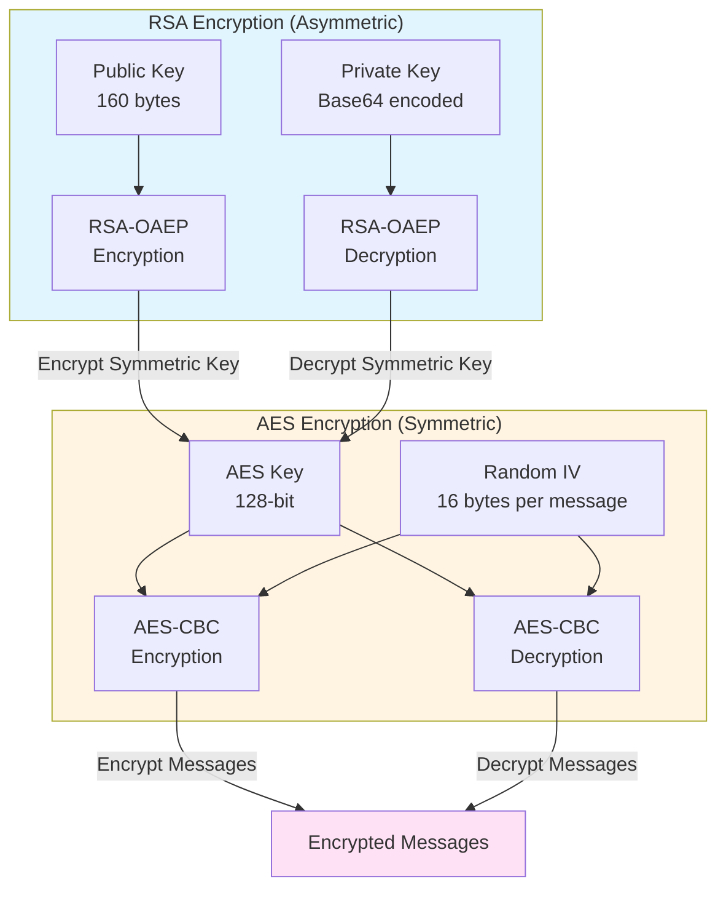
```mermaid
graph TB
    subgraph RSA["RSA Encryption (Asymmetric)"]
        RSA_Pub[Public Key<br/>160 bytes]
        RSA_Priv[Private Key<br/>Base64 encoded]
        RSA_Enc[RSA-OAEP<br/>Encryption]
        RSA_Dec[RSA-OAEP<br/>Decryption]
    end

    subgraph AES["AES Encryption (Symmetric)"]
        AES_Key[AES Key<br/>128-bit]
        AES_IV[Random IV<br/>16 bytes per message]
        AES_Enc[AES-CBC<br/>Encryption]
        AES_Dec[AES-CBC<br/>Decryption]
    end

    RSA_Pub --> RSA_Enc
    RSA_Priv --> RSA_Dec
    RSA_Enc -->|Encrypt Symmetric Key| AES_Key
    RSA_Dec -->|Decrypt Symmetric Key| AES_Key

    AES_Key --> AES_Enc
    AES_IV --> AES_Enc
    AES_Key --> AES_Dec
    AES_IV --> AES_Dec

    AES_Enc -->|Encrypt Messages| Messages[Encrypted Messages]
    AES_Dec -->|Decrypt Messages| Messages

    style RSA fill:#e1f5ff
    style AES fill:#fff4e1
    style Messages fill:#ffe1f5
```

### Security Features

| Feature                    | Implementation                                  | Purpose                                |
| -------------------------- | ----------------------------------------------- | -------------------------------------- |
| **RSA Key Exchange**       | 1024-bit RSA-OAEP                               | Secure symmetric key distribution      |
| **AES Message Encryption** | AES-128-CBC                                     | Fast, secure message encryption        |
| **Random IV**              | Generated per message                           | Prevents pattern detection attacks     |
| **End-to-End Encryption**  | Server never sees plaintext                     | Maximum privacy                        |
| **Key Storage**            | Private key in `my.info`, symmetric keys in RAM | Balance between security and usability |

---

<a id="protocol-reference"></a>

## 📋 Protocol Reference

### Request Codes (Client → Server)

| Code     | Decimal | Description        | Payload Size |
| -------- | ------- | ------------------ | ------------ |
| `0x0258` | 600     | Register           | 415 bytes    |
| `0x0259` | 601     | Clients List       | 0 bytes      |
| `0x025A` | 602     | Public Key Request | 16 bytes     |
| `0x025B` | 603     | Send Message       | Variable     |
| `0x025C` | 604     | Pull Messages      | 0 bytes      |
| `0x025D` | 605     | Delete User        | 0 bytes      |

### Response Codes (Server → Client)

| Code     | Decimal | Description          | Payload                     |
| -------- | ------- | -------------------- | --------------------------- |
| `0x0834` | 2100    | Registration Success | UUID (16 bytes)             |
| `0x0835` | 2101    | Clients List         | List of (UUID + Username)   |
| `0x0836` | 2102    | Public Key           | UUID (16) + PublicKey (160) |
| `0x0837` | 2103    | Message Sent         | UUID (16) + MsgID (4)       |
| `0x0838` | 2104    | Waiting Messages     | List of messages            |
| `0x0839` | 2105    | Delete Success       | Empty                       |
| `0x2328` | 9000    | General Error        | Error message               |

### Message Types (Payload of Code 603)

| Type   | Decimal | Description           | Content                 |
| ------ | ------- | --------------------- | ----------------------- |
| `0x01` | 1       | Symmetric Key Request | Empty                   |
| `0x02` | 2       | Symmetric Key Send    | RSA-encrypted AES key   |
| `0x03` | 3       | Text Message          | AES-encrypted text      |
| `0x04` | 4       | File Transfer         | AES-encrypted file data |

### Protocol Sizes

| Field         | Size (bytes) | Description                  |
| ------------- | ------------ | ---------------------------- |
| ClientID      | 16           | UUID in binary format        |
| Version       | 1            | Protocol version (2)         |
| Request Code  | 2            | Request type identifier      |
| Response Code | 2            | Response type identifier     |
| Payload Size  | 4            | Size of payload (Big-Endian) |
| Username      | 255          | Fixed-size, null-padded      |
| Public Key    | 160          | RSA public key (binary)      |
| Message ID    | 4            | Auto-increment message ID    |
| Message Type  | 1            | Type of message (1-4)        |
| Content Size  | 4            | Size of message content      |

### Request Header Format

```
┌─────────────┬──────────┬──────────┬──────────────┐
│ ClientID    │ Version  │ Code     │ PayloadSize  │
│ (16 bytes)  │ (1 byte) │ (2 bytes)│ (4 bytes)    │
└─────────────┴──────────┴──────────┴──────────────┘
Total: 23 bytes
```

### Response Header Format

```
┌──────────┬──────────┬──────────────┐
│ Version  │ Code     │ PayloadSize  │
│ (1 byte) │ (2 bytes)│ (4 bytes)    │
└──────────┴──────────┴──────────────┘
Total: 7 bytes
```

---

## 🗄️ Database Schema

### `clients` Table

| Column       | Type      | Constraints               | Description           |
| ------------ | --------- | ------------------------- | --------------------- |
| `uuid`       | BLOB(16)  | PRIMARY KEY               | Client UUID in binary |
| `username`   | TEXT      | UNIQUE, NOT NULL          | Client username       |
| `public_key` | BLOB(160) | NOT NULL                  | RSA public key        |
| `last_seen`  | TIMESTAMP | DEFAULT CURRENT_TIMESTAMP | Last activity         |

### `messages` Table

| Column       | Type      | Constraints               | Description               |
| ------------ | --------- | ------------------------- | ------------------------- |
| `id`         | INTEGER   | PRIMARY KEY AUTOINCREMENT | Message ID                |
| `target_id`  | BLOB(16)  | NOT NULL, FOREIGN KEY     | Recipient UUID            |
| `from_id`    | BLOB(16)  | NOT NULL, FOREIGN KEY     | Sender UUID               |
| `type`       | INTEGER   | NOT NULL                  | Message type (1-4)        |
| `content`    | BLOB      | NOT NULL                  | Encrypted message content |
| `created_at` | TIMESTAMP | DEFAULT CURRENT_TIMESTAMP | Creation timestamp        |

---

## 📁 File Structure

### Client Files

#### `my.info`

Stores user's registration data (created after successful registration):

```
Line 1: Username
Line 2: UUID (hex string, 32 characters)
Line 3: Private key (Base64 encoded)
```

#### `server.info`

Stores server connection information:

```
Line 1: Server hostname/IP address
Line 2: Server port number
```

### Server Files

#### `defensive.db`

SQLite database containing:

- `clients` table: All registered users
- `messages` table: All queued messages

#### `myport.info`

Server port configuration:

```
Line 1: Port number (default: 1357)
```

---

## 🔧 Technical Notes

### Byte Order

- All multi-byte integers use **Big-Endian** (Network Byte Order)
- This ensures compatibility between C++ (client) and Python (server)

### UUID Format

- **Storage**: Binary format (16 bytes) in database and network protocol
- **Display**: Hexadecimal string (32 characters) in UI and files
- **Conversion**: Automatic conversion between formats in handlers

### Error Handling

- **Client-side**: Input validation, file existence, key availability checks
- **Server-side**: Authentication, payload validation, database constraint checks
- **Network**: Connection failures, timeouts, protocol errors
- **Cryptographic**: Decryption failures, key mismatches, invalid formats

### Concurrency

- **Server**: Uses I/O multiplexing (selectors) to handle multiple clients concurrently
- **Client**: Single-threaded, synchronous operations
- **Database**: SQLite handles concurrent reads, writes are serialized

---

## 📚 Additional Resources

- **README.md**: Quick start guide and build instructions
- **REFACTORING_RECOMMENDATIONS.md**: Code organization and architecture details
- **SECURITY_ASSESSMENT.md**: Security analysis and recommendations

---

_Last Updated: Based on refactored modular architecture (v1.12+)_
